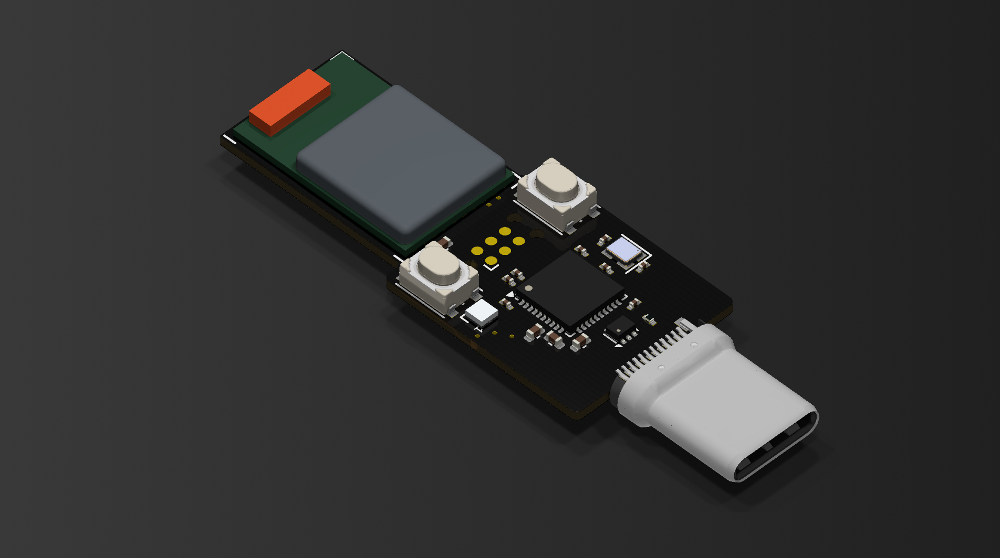

# nRF54L15 Dongle

  

High-performance BLE development dongle featuring Nordic's nRF54L15 SoC with integrated nRF52833-based debugger.

## Hardware

- nRF54L15 SoC with BLE 6.0 and 4Mbps proprietary PHY
- Integrated nRF52833 as pyOCD debugger and UART-USB bridge
- USB Type-C plug for direct computer connection
- RGB LED and dual buttons (reset + user/bootloader)

## Features

- Onboard debugging eliminates external tools
- Concurrent debug and serial bridge operation
- High-throughput 4Mbps proprietary radio mode
- Compact plug-in form factor
